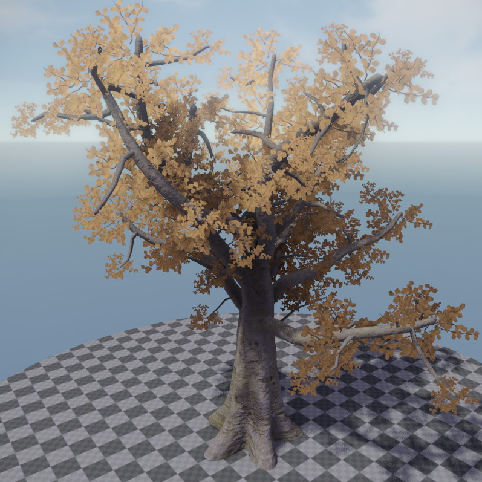

# Kraut

*Kraut* is a tool for procedurally generating trees and other plants. Tree files are authored in the stand-alone Kraut editor, which you can get [here](https://github.com/jankrassnigg/Kraut).

The *Kraut asset* references the *.tree* file that the Kraut editor writes. You then have to specify the [materials](../materials/materials-overview.md) that shall be used for each tree part. Note that there are three Kraut specific base materials (under *Plugins/Kraut*) which have to be used as the *base materials*. Kraut uses a custom shader, and these base materials pull in the correct shader and configure it to be used for *stems* (trunk, branches, twigs), *fronds* (static leaves) or *leaves* (billboards).

Once a Kraut tree config is imported and set up, dragging the asset into a scene, will instantiate a Kraut tree component.

<!-- TODO: add more details at some point -->

## See Also

* [Back to Index](../index.md)
* [Heightfield Component](heightfield-component.md)