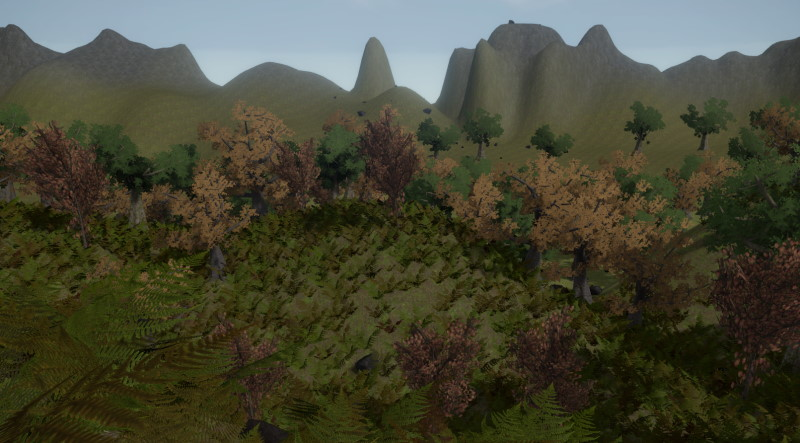

# Terrain and Vegetation

## Terrain

Currently there are no tools for creating terrain. Terrain meshes are best build in external tools and imported as regular [static meshes](../graphics/meshes/meshes-overview.md).

A popular method to represent terrain are heightmaps - 2D grayscale images, where the brightness of each pixel represents the height of the terrain at that location. ezEngine provides a [heightfield component](heightfield-component.md) which enables you to get such terrain data into the engine easily. However, this is only meant for simple use cases.

## Vegetation

Vegetation can be created with standard meshes. Using custom [visual shaders (TODO)](../materials/visual-shaders.md), a basic per-vertex wind animation can be applied.

Additionally, ezEngine has built in support for [Kraut](kraut-overview.md), a tool that allows you to procedurally generate tree meshes.

Finally, there is a system to procedurally place objects, typically plants, around the current player position. This system is currently undocumented, but the [Testing Chambers](../samples/testing-chambers.md) project contains scenes which show basic usage.

## See Also

* [Back to Index](../index.md)
* [Heightfield Component](heightfield-component.md)
