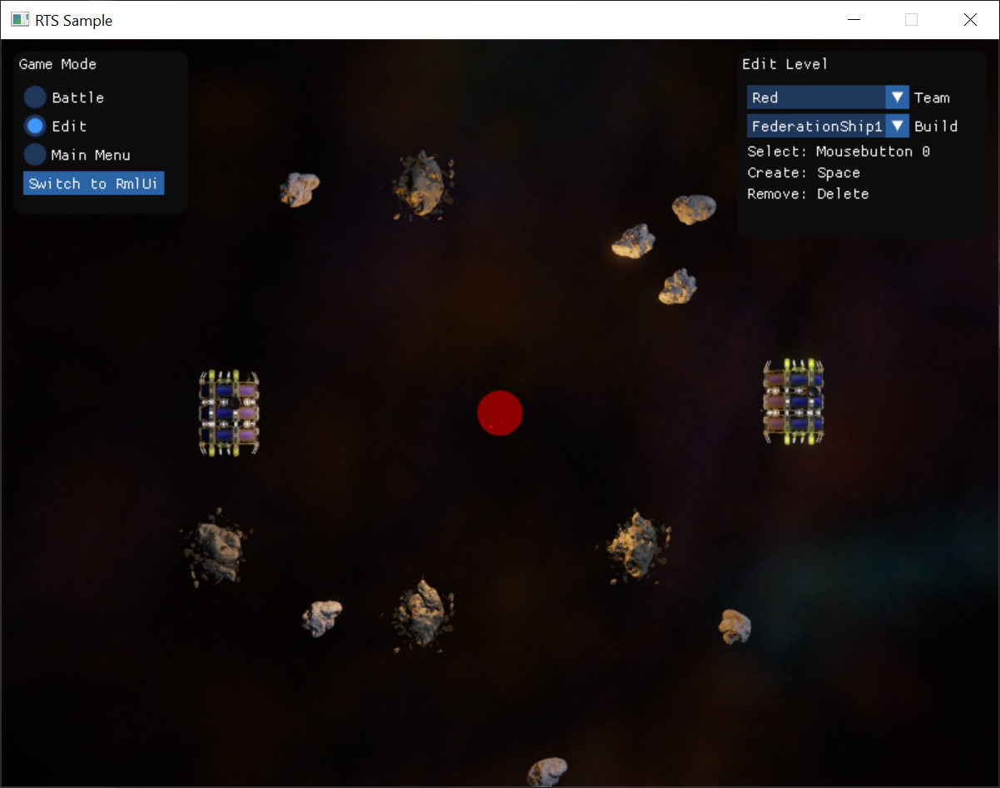

# ImGui

[Dear ImGui](https://github.com/ocornut/imgui) is a well known library for building *immediate mode GUIs*.

The ImGui library was built to make it quick and easy to create GUIs that need to be functional, but not pretty. ImGui is popular with programmers, because it only takes a few lines of code to build UI panels with buttons, sliders, text boxes, checkboxs and many more. A very common use case for ImGui is for quick developer tools and for exposing options in tech demos.



On the other hand, ImGui is not meant to be styled. Changing the appearance of ImGui elements is difficult, and controlling the layout of elements is only very basic.

## Using ImGui

*Dear ImGui* is integrated by the singleton class `ezImgui`. To use ImGui, you need to allocate one such instance first:

<!-- BEGIN-DOCS-CODE-SNIPPET: imgui-alloc -->
```cpp
#ifdef BUILDSYSTEM_ENABLE_IMGUI_SUPPORT
  if (ezImgui::GetSingleton() == nullptr)
  {
    EZ_DEFAULT_NEW(ezImgui);
  }
#endif
```
<!-- END-DOCS-CODE-SNIPPET -->

This can be done for example in `OnActivation()` of a custom [game state](../runtime/application/game-state.md). Similarly, you should delete the `ezImgui` instance at shutdown:

<!-- BEGIN-DOCS-CODE-SNIPPET: imgui-dealloc -->
```cpp
#ifdef BUILDSYSTEM_ENABLE_IMGUI_SUPPORT
  if (ezImgui::GetSingleton() != nullptr)
  {
    ezImgui* pImgui = ezImgui::GetSingleton();
    EZ_DEFAULT_DELETE(pImgui);
  }
#endif
```
<!-- END-DOCS-CODE-SNIPPET -->

During a frame, the `ezImgui` instance needs to know which *view* to render the UI elements to. Therefore you should call this every frame:

<!-- BEGIN-DOCS-CODE-SNIPPET: imgui-activate -->
```cpp
ezImgui::GetSingleton()->SetCurrentContextForView(m_hMainView);
```
<!-- END-DOCS-CODE-SNIPPET -->

Often you only want to pass input to ImGui during certain phases of your game. This can be controlled via `ezImgui::SetPassInputToImgui()` and whether ImGui currently has focus in a certain UI element can be queried through `ezImGui::WantsInput()`.

From there on, all the functionality of the Dear ImGui library is used directly, without any EZ specific wrappers. For example a simple panel is created like this:

<!-- BEGIN-DOCS-CODE-SNIPPET: imgui-panel -->
```cpp
ImGui::SetNextWindowSize(ImVec2(200, 100), ImGuiCond_FirstUseEver);
ImGui::Begin("Imgui Window", &window);
ImGui::Text("Hello World!");
ImGui::SliderFloat("Slider", &slider, 0.0f, 1.0f);
ImGui::ColorEdit3("Color", color);


if (ImGui::Button("Toggle Stats"))
{
  stats = !stats;
}

if (stats)
{
  ImGui::Text("Application average %.3f ms/frame (%.1f FPS)", 1000.0f / ImGui::GetIO().Framerate, ImGui::GetIO().Framerate);
}

ImGui::End();
```
<!-- END-DOCS-CODE-SNIPPET -->

## Samples

The [RTS Sample](../samples/rts.md) and the [Sample Game Plugin](../samples/sample-game-plugin.md) demonstrate how to use ImGui.

## Limitations

It is very difficult to adjust the appearance of ImGui elements. Use ImGui for developer tools and to prototype ideas quickly. Prefer to use [RmlUi](rmlui.md) once you need more control over the look and feel.

## See Also

* [Back to Index](../index.md)
* [Ingame UI](ui.md)
* [RmlUi](rmlui.md)