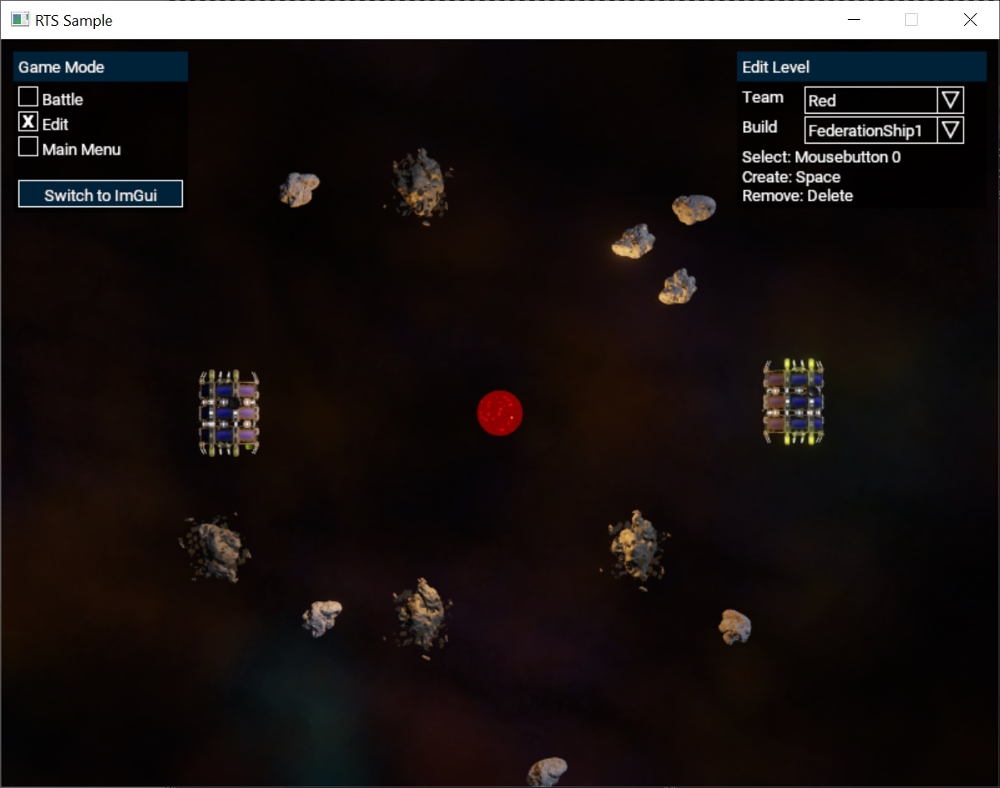
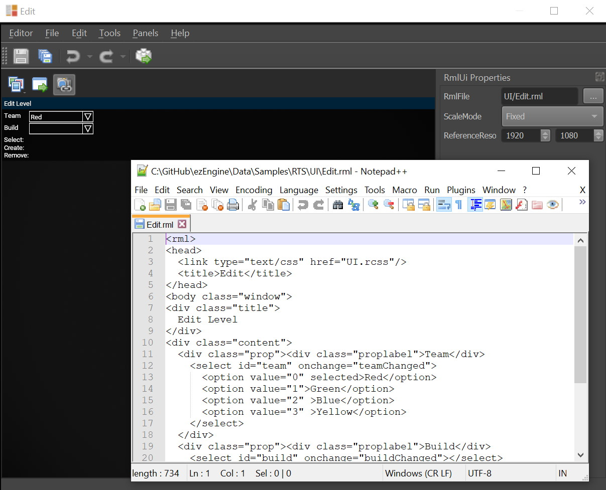

# RmlUi

[RmlUi](https://github.com/mikke89/RmlUi) is a third-party GUI library that uses an HTML-like syntax to describe UI elements, and CSS to style them. RmlUi is lightweight, yet flexible.

Support for RmlUi is provided through a dedicated [engine plugin](../custom-code/cpp/engine-plugins.md). To enable it in your project, activate the plugin in the [project settings](../projects/project-settings.md).

## Rml Documentation

The documentation for RmlUi [can be found here](https://mikke89.github.io/RmlUiDoc/index.html).

Please refer to that documenation for any questions around how to use RmlUi.

## Sample

The [RTS Sample](../samples/rts.md) shows how to use RmlUi. Have a look at it the project in the editor, it contains Rml assets. The editor shows a live preview for Rml canvases, and you can edit the respective `.rml` files to see the effect:

The sample uses multiple *RmlUi Canvas 2D* components in its scene to place the UI elements. At runtime the RTS sample's game code accesses the RmlUi functionality through the `ezRmlUiCanvas2DComponent`. Search the sample's code for those places to see how to interact with the GUI.

Using `ezRmlUiCanvas2DComponent::GetRmlContext()` you get access to the `ezRmlUiContext`. This class implements `Rml::Core::Context`. This gives you access to all the RmlUi features. See the RmlUi [documentation](https://mikke89.github.io/RmlUiDoc/index.html) for details.

## Work in Progress

The integration of RmlUi into ezEngine is functional, but still a work-in-progress. At the moment you can only build 2D GUIs that appear on top of the screen. In the future we plan to also support placing GUI elements inside the 3D environment.

Also, currently you need to work directly with the RmlUi C++ code to interact with the UI. We may add convenience functionality to make simple use cases of GUIs easier.

There is no TypeScript binding for RmlUi. Most likely this will never change, however, if we get around to adding some convenience features, that may make it possible to use a limited feature set from script code.

## See Also

* [Back to Index](../index.md)
* [Ingame UI](ui.md)
* [ImGui](imgui.md)